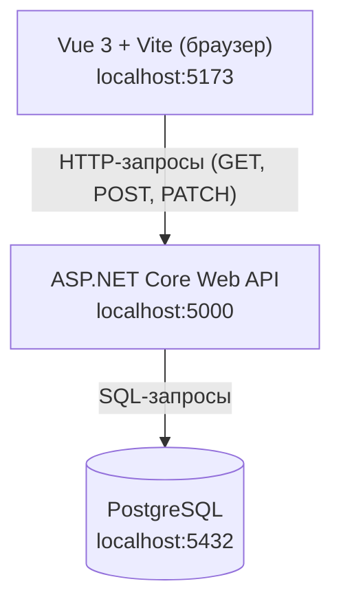

# Архитектура web-ИС

## Схема из трёх узлов

**Подпись:** Это и есть архитектура web-ИС семестра — три узла, две связи, один источник правды о заявках.

**Прямой стрелки от браузера к базе нет:** иначе клиент получает доступ к данным и обходит серверные правила.

**Почему именно так:**
- Браузер шлёт HTTP-запросы на сервер, а не в базу — правда о заявках живёт на сервере.
- Сервер — единственный, кто общается с PostgreSQL.
- В методичке прямо предупреждают: не рисуй стрелку `Браузер → PostgreSQL`.
