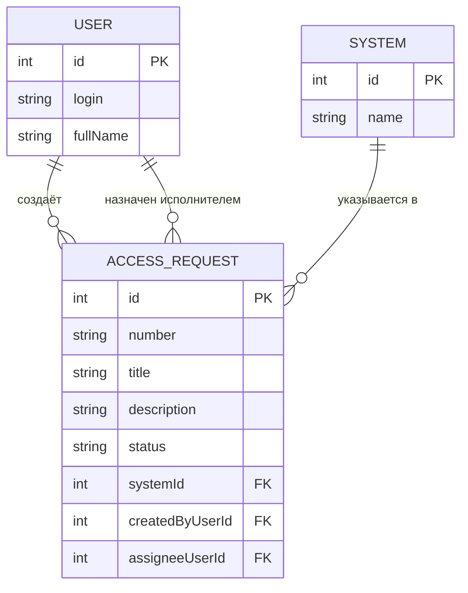

# Модель данных

## Словарь проекта

| Термин курса | Термин моей темы |
|---|---|
| Ticket | Заявка на доступ (AccessRequest) |
| Site | Система (System) |
| User | Пользователь (User) |

## ER-диаграмма

**Связи словами:**
- Одна **система** — много **заявок**.
- Один **пользователь** создаёт много **заявок**.
- Один **пользователь** может быть назначен исполнителем на много **заявок**.
- У новой заявки исполнитель может отсутствовать (`assigneeUserId` — nullable).

## Ключи

| Сущность | Первичный ключ (PK) | Внешние ключи (FK) |
|---|---|---|
| User | id | — |
| System | id | — |
| AccessRequest | id | systemId → System.id, createdByUserId → User.id, assigneeUserId → User.id |

## Поля главного объекта

| Поле | Тип | Обязательное | Смысл |
|---|---|---|---|
| id | int | да | машинный ключ для API |
| number | string | да | человеческий номер («AR-104») |
| title | string | да | заголовок заявки |
| description | string | да | описание проблемы |
| status | string | да | New, InProgress, Closed, Cancelled |
| systemId | int | да | ссылка на справочник систем |
| createdByUserId | int | да | кто создал заявку |
| assigneeUserId | int | нет | кому назначена, может быть null |

## Проверка 3НФ

Название системы хранится в сущности **System** один раз. **AccessRequest** содержит только внешний ключ `systemId`. Если название системы изменится, поменяется одна строка в `System`, а не десятки заявок. Дублирования текста нет, значит, модель в третьей нормальной форме.

Также `createdByUserId` и `assigneeUserId` — это ссылки на `User`, а не текстовые ФИО. ФИО хранится в одном месте.
